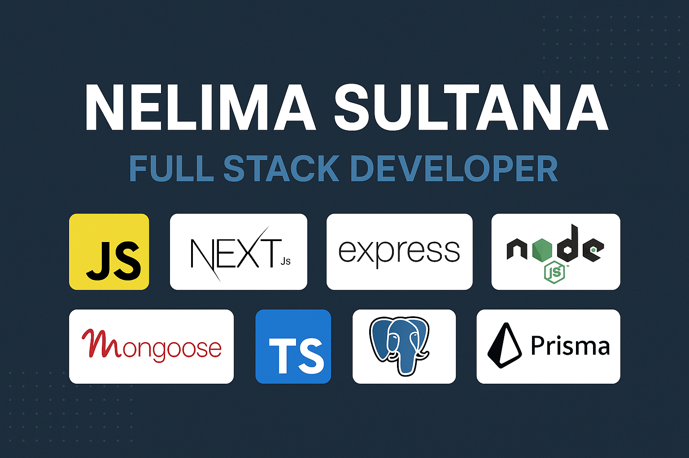

## Hello, Visitor! 

Meet Nelima Sultana, a gentle artisan in the world of Full stack development, delicately weaving code into beautiful digital tapestries that enchant the user's experience with a touch of grace.

## Bio
- ✨ I'm expert in:  `.js`, `.node`, `.mongoose `,`.typescript`
- 🌱 I’m currently learning: **PostgreSQL**
- 💬 Send your thoughts on:  **Web Design** | **Development**
- 📫 Contact me: [Email](mailto:neelimasultana6@gmail.com/) 

## Skills

  

## Overview

|   |  | 
| ------------- | ------------- |

